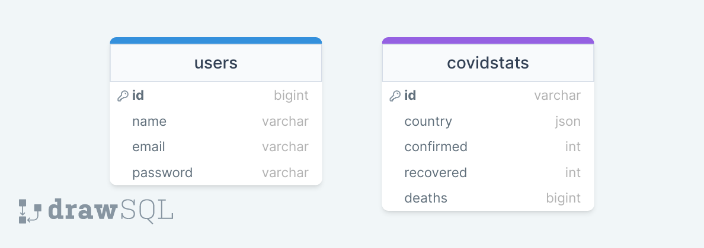

<div style="display:flex; align-items: center">
  
  <h1 style="position:relative; top: -6px" >Coronatime App</h1>
</div>

Coronatime is a web application that provides verified users with access to global and country-level Coronavirus statistics. Once registered and verified, users can browse and interact with the data to better understand the pandemic's impact. The platform offers a comprehensive and easy-to-use interface, enabling users to view key statistics and trends, as well as to filter and sort the data based on their preferences.

#

### Table of Contents

-   [Prerequisites](#prerequisites)
-   [Tech Stack](#tech-stack)
-   [Getting Started](#getting-started)
-   [Populate database](#migration-and-populating-database)
-   [Development](#development)
-   [Project Structure](#project-structure)

#

### Prerequisites

-    *PHP@8.2 and up*
-    _MYSQL@8 and up_
-    _npm@8.19 and up\_
-    _composer@2 and up_
-    _Laravel@9 and up_

#

### Tech Stack

-    [Laravel@9.x](https://laravel.com/docs/9.x) - back-end framework
-    [Spatie Translatable](https://github.com/spatie/laravel-translatable) - package for translation
-    [Tailwind](https://tailwindui.com/) - CSS framework
-    [Vite](https://vitejs.dev/) - frontend tooling

#

### Getting Started

1\. First of all you need to clone Coronatime repository from github:

```sh
git clone https://github.com/RedberryInternship/elene-metreveli-coronatime.git
```

2\. Next step requires you to run _composer install_ in order to install all the dependencies.

```sh
composer install
```

3\. after you have installed all the PHP dependencies, it's time to install all the JS dependencies:

```sh
npm install
```

and also:

```sh
npm run dev
```

in order to build your JS/SaaS resources.

#

### Migration and Populating Database

Migration is a fairly simple process, just execute:

```sh
php artisan migrate
```

And populate the covidstats table:

```sh
php artisan coronatime:update-covidstats
```

### Development

You can run Laravel's built-in development server by executing:

```sh
  php artisan serve
```

When working on JS you should run:

```sh
  npm run dev
```

It builds your JS files into executable scripts.

### Project Structure

```bash
├─── app
│   ├─── Console
│   ├─── Exceptions
│   ├─── Http
│   ├─── Models
│   ├─── Providers
├─── bootstrap
├─── config
├─── database
├─── lang
├─── public
├─── resources
├─── routes
├─── storage
├─── tests
- .env
- artisan
- composer.json
- package.json
- tailwind.config.json
- vite.config.json
```

Project structure is fairly straitforward (at least for Laravel developers).

For more information about project standards, take a look at these docs:

-   [Laravel](https://laravel.com/docs/9.x/)

#

### Database Design Diagram



#

### Resources

[Figma Design](https://www.figma.com/file/O9A950iYrHgZHtBuCtNSY8/Coronatime?node-id=0%3A1)
